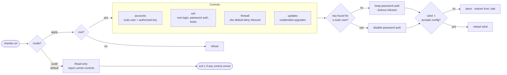

<div align="center">

# Linux Server Hardening

**An auditable hardening baseline for Ubuntu and Debian servers.**

SSH · firewall · accounts · automatic updates — audited by default, applied only when you ask

[](https://github.com/Gautam-CyberSec/Linux-Server-Hardening/actions/workflows/ci.yml)
[](harden.sh)
[](.github/workflows/ci.yml)
[](LICENSE)

[Architecture](ARCHITECTURE.md) ·
[Lessons learned](LESSONS.md) ·
[Security](SECURITY.md) ·
[Original lab report](Report/Report.md) ·
[Contributing](CONTRIBUTING.md)

</div>

---

I hardened a server by hand, wrote down every step, and then found the write-up
was worth less than the thing itself: nobody can run a document, and nothing
checks whether the server drifted back a month later.

So the write-up became a script. It audits a host against a fixed set of
controls, tells you exactly which ones are unmet, and changes nothing unless you
ask it to. The [original lab report](Report/Report.md) is still here, with every
screenshot — it is the reasoning that produced the code.

```bash
git clone https://github.com/Gautam-CyberSec/Linux-Server-Hardening.git
cd Linux-Server-Hardening
./harden.sh audit          # read-only, safe on a production box
```

Auditing a host that has never been hardened:

```console
$ ./harden.sh audit

SSH
  → PermitRootLogin is yes, should be no
  → PermitEmptyPasswords is unset, should be no
  → X11Forwarding is yes, should be no
  → MaxAuthTries is unset, should be 3
  → LoginGraceTime is unset, should be 30
  → PasswordAuthentication is enabled
  ! refusing to disable it: no authorised key found for any sudo user
  · add a key first, or re-run with --allow-password-lockout if you
  · have console access and accept the risk

Summary
  6 control(s) unmet. Re-run as: sudo ./harden.sh apply
```

Then applying it, once a key is in place:

```console
$ sudo ./harden.sh apply --only ssh
harden.sh 1.0.0  ·  ubuntu 24.04  ·  mode: apply

SSH
  → PermitRootLogin is yes, should be no
  · backed up /etc/ssh/sshd_config → /etc/ssh/sshd_config.bak-20260808-165613
  ✓ PermitRootLogin → no
  ✓ PermitEmptyPasswords → no
  ✓ X11Forwarding → no
  ✓ MaxAuthTries → 3
  ✓ LoginGraceTime → 30
  ✓ PasswordAuthentication → no (key verified for 'deploy')
  ✓ sshd validated the new configuration

Summary
  6 change(s) applied, 6 finding(s) seen.
  ! verify you can open a NEW ssh session before closing this one
```

Backup, then change, then validation — and it names the key holder it verified
before touching password authentication.

## What it checks



| Control | Enforces |
|---|---|
| `accounts` | A non-root sudo user exists, and at least one has an authorised key |
| `ssh` | `PermitRootLogin no`, `PasswordAuthentication no`, `PermitEmptyPasswords no`, `X11Forwarding no`, `MaxAuthTries 3`, `LoginGraceTime 30` |
| `firewall` | ufw installed and active, default deny inbound, allow outbound, SSH permitted on its **actual** port |
| `updates` | `unattended-upgrades` installed and enabled |

## Four decisions worth reading

| | Decision | Why |
|---|---|---|
| 1 | **Audit is the default; `apply` is explicit** | The dangerous mode should be the one you have to ask for. Audit is safe to run on production and exits non-zero on unmet controls, so it works as a CI or cron gate. |
| 2 | **Password auth is never disabled without a proven key** | This is the change that strands you. The script looks for a non-empty `authorized_keys` on a sudo user and refuses otherwise. `--allow-password-lockout` overrides it, and says plainly what you are risking. |
| 3 | **The firewall rule follows the real SSH port** | It reads `Port` from `sshd_config` rather than assuming 22. Enabling default-deny while allowing the wrong port is the classic way to lock yourself out mid-hardening. |
| 4 | **Nothing is reloaded until `sshd -t` accepts it** | A syntactically invalid config that gets reloaded takes SSH down with it. Every edit is backed up first, validated second, reloaded third. |

Full reasoning, including what was rejected, is in **[ARCHITECTURE.md](ARCHITECTURE.md)**.

## Usage

```bash
./harden.sh                          # audit (default)
sudo ./harden.sh apply               # apply every control
sudo ./harden.sh apply --only ssh    # one control at a time
./harden.sh --help                   # all options
```

| Option | Purpose |
|---|---|
| `--only LIST` | Subset of `accounts,ssh,firewall,updates` |
| `--ssh-port N` | Expected SSH port; the firewall rule follows it |
| `--sshd-config PATH` | Operate on a different config — used by the tests |
| `--allow-password-lockout` | Disable password auth with no key present. Can strand you. |

Audit exits `1` when any control is unmet, so it drops straight into a pipeline:

```bash
./harden.sh audit || echo "server has drifted from baseline"
```

> **Before applying to a server you care about:** confirm you can open a *new*
> SSH session with a key before closing the one you ran this from. Every edited
> file gets a timestamped `.bak-` copy next to it.

## Repository layout

```
├── harden.sh              entry point — argument parsing and controls
├── lib/
│   ├── common.sh          logging, backups, dry-run state
│   └── sshd_config.sh     sshd_config parsing and editing (pure, testable)
├── tests/
│   ├── test_sshd_config.sh   16 unit tests, no root or sshd needed
│   ├── integration.sh        runs against a real Ubuntu + real sshd
│   └── Dockerfile            the Ubuntu 24.04 test target
├── Report/Report.md       the original manual lab, step by step
├── Screenshots/           evidence from that lab
└── .github/workflows/     shellcheck · shfmt · unit · integration · links
```

## Development

```bash
make check          # shellcheck, shfmt and the unit tests
make integration    # full run in an Ubuntu container (needs Docker)
make audit          # audit this machine
```

The config-editing code is written as pure functions over a file path, so the
tests exercise the real implementation against fixtures rather than a mock. CI
additionally runs the unit suite on **macOS bash 3.2**, which is what stops
bash-4-only syntax reaching contributors who cannot run it.

## Security

The script needs root to apply changes and does exactly four things that matter:
edits `sshd_config`, configures `ufw`, installs two packages, and writes an apt
config. It never fetches remote code, never opens a network listener, and never
transmits anything off the host. Details and the reporting route:
[SECURITY.md](SECURITY.md).

## Roadmap

- [ ] `fail2ban` control for SSH brute-force throttling
- [ ] Kernel parameter hardening via `sysctl`
- [ ] Optional CIS Benchmark mapping for each control
- [ ] JSON output mode for fleet-wide reporting
- [ ] AppArmor profile status reporting

## Engineering decisions &amp; lessons learned

Six mistakes made while turning the manual lab into a tested script — including
bash syntax the development machine did not support, a `NO_COLOR` flag that
printed twelve errors while failing to disable colour, and a test that reported
a working safety guard as broken.

**[Read the retrospective →](LESSONS.md)**

## Licence

Code is [MIT](LICENSE). The lab report and screenshots under `Report/` and
`Screenshots/` are [CC BY 4.0](LICENSE-DOCS).

---

<div align="center">

**Gautam** · Cloud &amp; Backend Engineer

[Portfolio](https://Gautam-cloud.com) ·
[LinkedIn](https://linkedin.com/in/gautam-cybersec) ·
[gautamdem@gmail.com](mailto:gautamdem@gmail.com)

</div>
